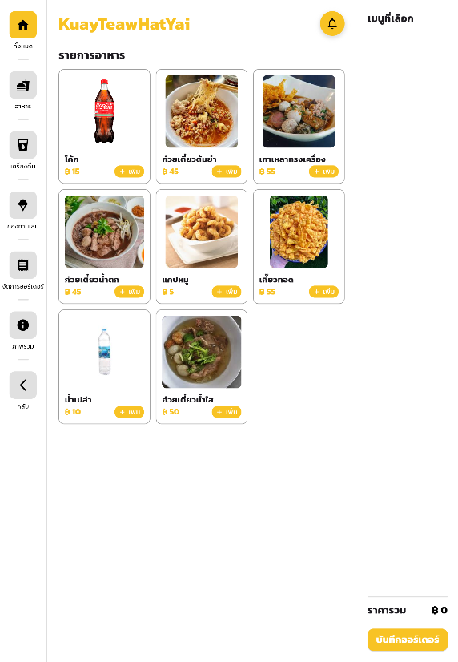

# SA-KuayTeawHatYai

**SA-KuayTeawHatYai** is a Flutter web application designed for a noodle restaurant to streamline its operations. This application provides a simple yet powerful interface for staff to manage orders, view the menu, and track daily revenue.

## Features

- **Responsive Design**: Optimized for tablet layout, ensuring ease of use for restaurant staff.
- **Order Management**: Staff can easily take and manage customer orders.
- **Menu Display**: View an organized and up-to-date menu for seamless browsing.
- **Revenue Tracking**: Get a clear overview of daily revenue to monitor sales performance.
- **User-Friendly Interface**: Simple navigation and interactive elements tailored for restaurant operations.

## Installation

To run the app locally, follow these steps:

1. Clone the repository:
   ```bash
   git clone https://github.com/newnonsick/SA-KuayTeawHatYai.git
   ```

2. Navigate to the project directory:
   ```bash
   cd SA-KuayTeawHatYai
   ```

3. Install the dependencies:
   ```bash
   flutter pub get
   ```

4. Run the app:
   ```bash
   flutter run -d chrome
   ```

## Getting Started

1. Ensure you have Flutter installed on your machine.
2. Set up your preferred editor (e.g., Visual Studio Code, Android Studio).
3. Explore the project structure to understand the files and functionality.
4. Customize the application to fit your restaurant's needs.

## Screenshots



## Backend

This application works seamlessly with its backend to handle data processing and provide API endpoints. You can find the backend repository here: [SA-KuayTeawHatYai Backend](https://github.com/newnonsick/SA-KuayTeawHatYai-Backend/)

## License

This project is licensed under the MIT License. See the [LICENSE](LICENSE) file for details.

## Live Demo

You can access the live version of the app here: [SA-KuayTeawHatYai Live](https://kuayteawhatyai.vercel.app/)
